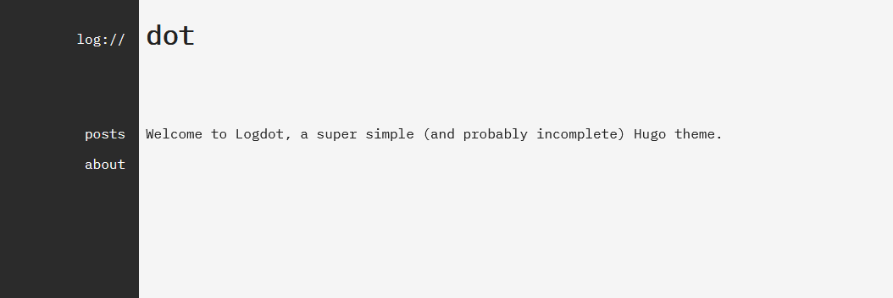

# Logdot

A super simple minimal Hugo theme.

For the **demo** and **thorough** installation instructions, check out the [guide](https://log.riley.work/posts/how-to-install-hugo-configure-logdot).

## Credits

- minimal-bootstrap-hugo-theme ([zwbetz-gh](https://github.com/zwbetz-gh/minimal-bootstrap-hugo-theme))
- poison ([lukeorth](https://github.com/lukeorth/poison))
    (social media svgs)