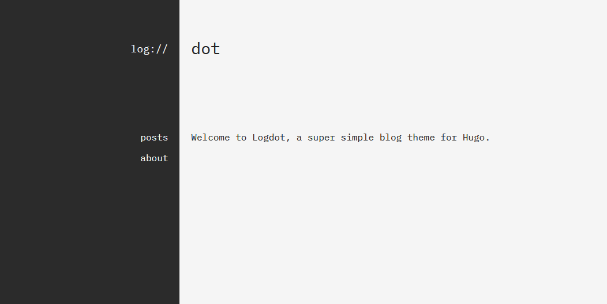

# Logdot

A super simple minimal Hugo theme. Check out the [demo](https://log.riley.work/demo)

## Credits
- Inspiration
    - [Hyde](https://github.com/spf13/hyde)
    - [poison](https://github.com/lukeorth/poison)
        - use of `socials` svgs
    - [Soho](https://github.com/alexandrevicenzi/soho)
    - [m10c](https://github.com/vaga/hugo-theme-m10c)
